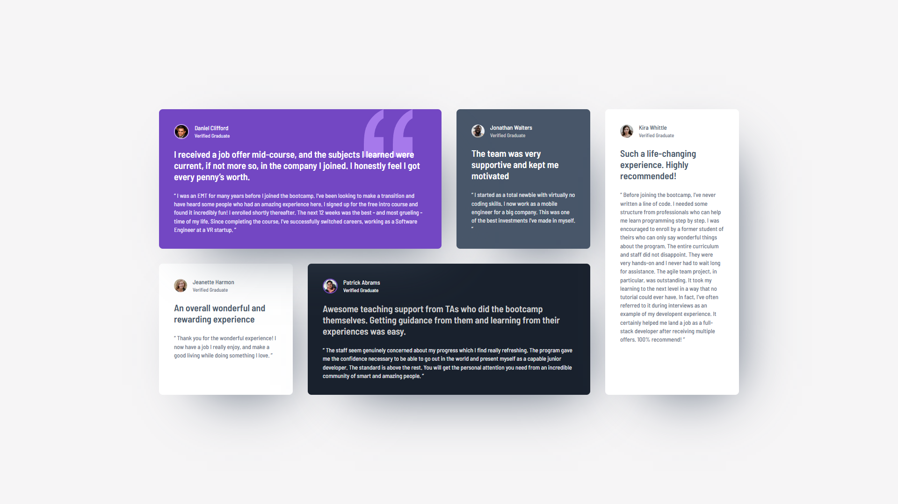

# Frontend Mentor - Testimonials grid section solution

This is a solution to the [Testimonials grid section challenge on Frontend Mentor](https://www.frontendmentor.io/challenges/testimonials-grid-section-Nnw6J7Un7).

## Table of contents

- [Overview](#overview)
  - [The challenge](#the-challenge)
  - [Screenshot](#screenshot)
  - [Links](#links)
- [My process](#my-process)
  - [Built with](#built-with)
  - [What I learned](#what-i-learned)
  - [Continued development](#continued-development)
  - [Useful resources](#useful-resources)
- [Author](#author)

## Overview

### The challenge

Users should be able to:

- View the optimal layout for the site depending on their device's screen size

### Screenshot



### Links

- Solution URL: [GitHub](https://github.com/g-akca/testimonials-grid-section)
- Live Site URL: [Testimonials Grid Section](https://g-akca.github.io/testimonials-grid-section/)

## My process

### Built with

- Semantic HTML5 markup
- CSS custom properties
- Flexbox
- CSS Grid
- Mobile-first workflow
- Media queries

### What I learned

Struggled while working on the desktop CSS Grid container because the original design had Daniel's card way more wider than mine. Realized later that I needed to explicitly set grid columns the same width, I had always thought that grid columns have the same width by default. It became a good lesson for me.

```css
#grid-container {
    grid-template-columns: 1fr 1fr 1fr 1fr;
    grid-template-areas:
        "daniel-card daniel-card jonathan-card kira-card"
        "jeanette-card patrick-card patrick-card kira-card";
    ...
}
```

### Continued development

Not sure if the way I handle body padding based on screen width is correct, using clamp might be better. I will continue to research.

### Useful resources

- [Box-shadow Generator - CSS | MDN](https://developer.mozilla.org/en-US/docs/Web/CSS/CSS_backgrounds_and_borders/Box-shadow_generator) - This tool helped me generate a box shadow similar to the original design.

## Author

- GitHub - [@g-akca](https://github.com/g-akca)
- Frontend Mentor - [@g-akca](https://www.frontendmentor.io/profile/g-akca)
